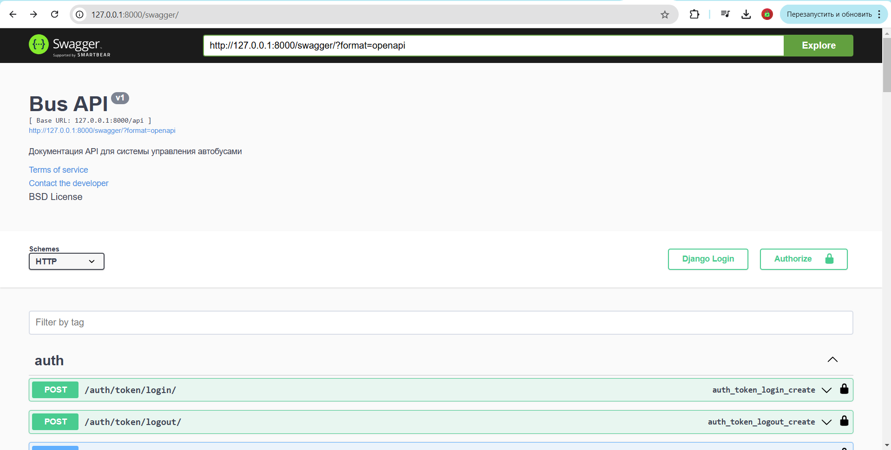
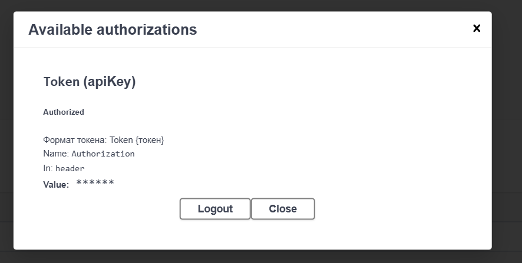
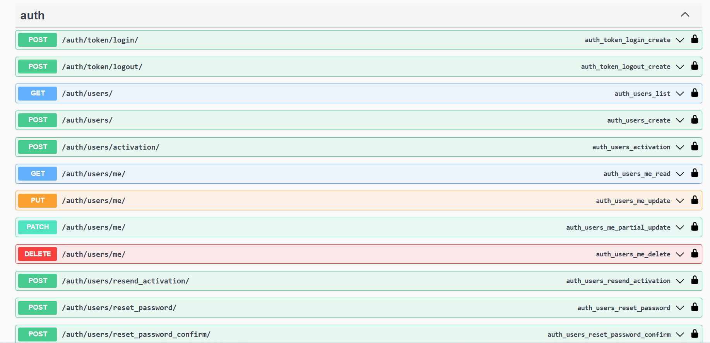
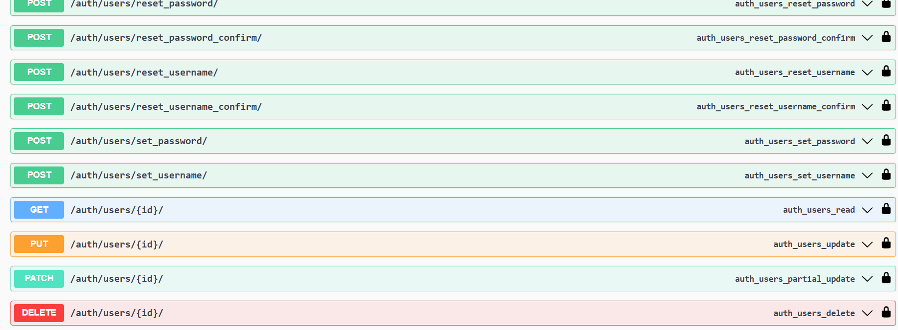
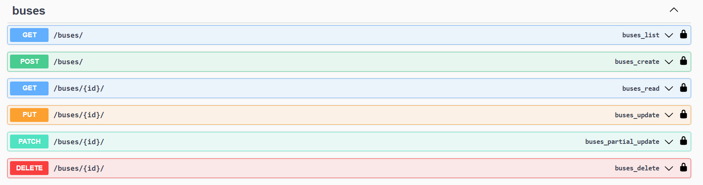
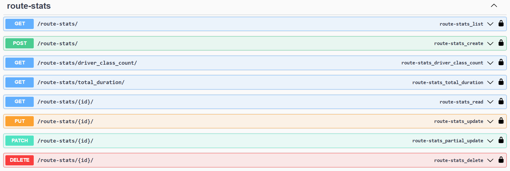
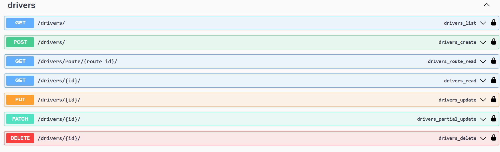
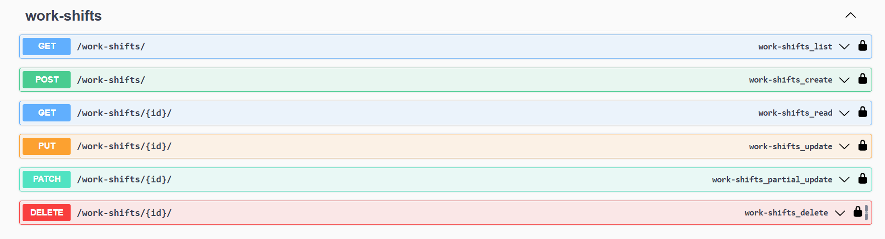
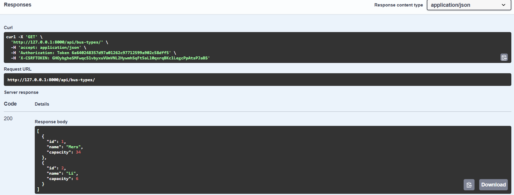
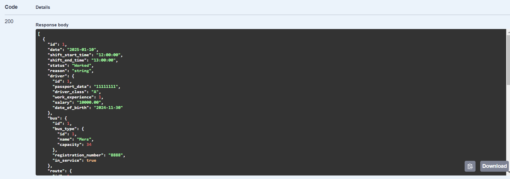

# Запросы

## Описание

Реализовать модели для приложения.

## Стек

- JSON
- Swagger
- api

## Запросы

Ссылка: http://127.0.0.1:8000/swagger/
  
Авторизация через токен
  
Запросы авторизации

  
bus-types
  
buses
  
route-stats
  
drivers
  
routes
  
work-shifts
  

## респонсы
  
## Вложенные
  
  